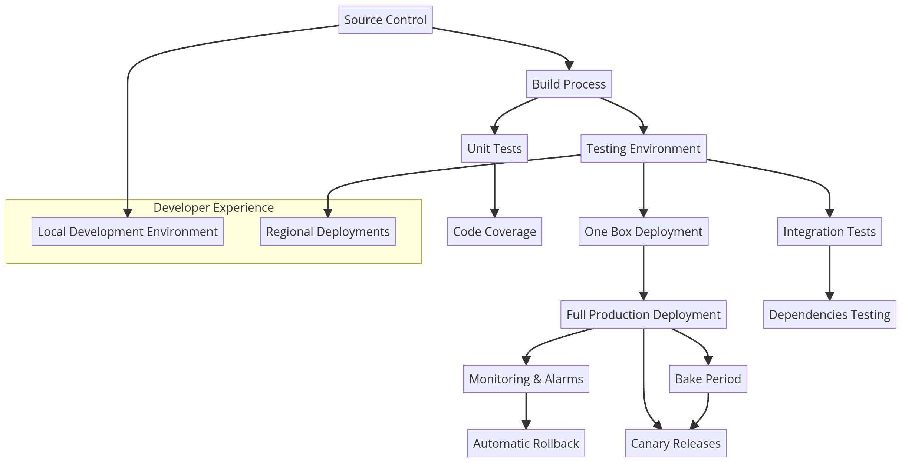
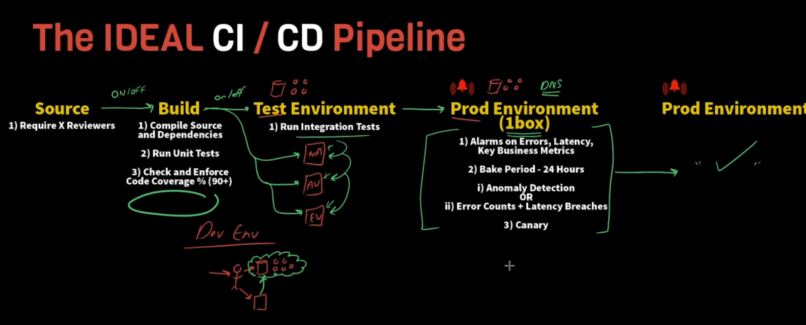

## The IDEAL & Practical CI/CD Pipeline - Concepts Overview

## The IDEAL & Practical CI/CD Pipeline - Concepts Overview

### Introduction
- **Motivation:** Many developers are unsure about the setup of their CI/CD pipeline or stack.
- **Objective:** Show a solid starting point for a stack setup and a CI/CD pipeline.
- **Focus:** General concepts that can be adapted to any technology (e.g., AWS, custom tools).
- **Additional Topics:** Developer experience in local stack development, testing, and production environments.

### Source Control
- **Storage:** All packages and dependencies for the application.
- **Recommendation:** Use Git for version control.
- **Review Mechanism:** 
  - Require pull request reviews before merging code.
  - Minimum: One reviewer.
  - Ideal: At least two reviewers.
- use code analysis tool

### Build Process
- **Trigger:** After committing a change to source code.
- **Actions:**
  - **Compile Source Code:** Includes dependencies (e.g., package.json, pom file).
  - **Run Unit Tests:** 
    - Ensure high coverage level.
    - Goal: Confidently push commits and catch errors early.
  - **Code Coverage:** 🙏
    - Aim for a minimum of 90%.
    - Each commit should meet or exceed this threshold.
    - ***for context:*** Code coverage i    s a metric used in software testing to measure the extent to which the source code of a program is tested.

### Testing Environment
- **Purpose:** Test changes before moving closer to production.
- **Integration Tests:** 🔥
  - Test APIs (e.g., create order, get order) for expected outcomes and business logic.
  - Validate dependencies (e.g., customer profile service -> storing, etc.).
- **Switch Mechanism:** Ability to turn stages on and off for controlled deployment.

### Deployment
- **Production Environment:** 
  - Traffic Managment: using DNS weights(url in DNS level), AWS Lambda weight factor(gave proportion to each function version)
  - **One Box Deployment:** (hosting 10% of that traffic)
    - Deploy changes to a small fraction (e.g., 10%) of production traffic.
    - Monitor for issues (e.g., alarms, latency, business metrics). 🧪
    - Rollback if necessary to avoid widespread impact just for that specific host(1 fraction).
  - **Full Production Rollout:** (hosting 90% of that traffic)
    - After successful monitoring(confident that everything work correctly), deploy that version to the remaining production environment. ✅
    - keep continuously monitoring and rollback

### Monitoring and Rollback 🔔 
- **Alarms:** Set up alarms for errors, latency, and business metrics. 
- **Automatic Rollback:** Trigger rollback if metrics exceed thresholds to previous version of the checkout process.
- **Bake Period:** 
  - Duration: Typically 24 hours.
  - Purpose: The bake period is a critical phase in a CI/CD pipeline where a new software deployment is closely monitored for stability and performance issues before it is fully rolled out to all users.

### Canary Releases
    - **Purpose:** Test production workflows with expected inputs and outputs.
    - **Implementation:** Set up cron jobs to run tests at regular intervals (e.g., every minute).
    - **Outcome:** Detect issues early and trigger alarms for rollback if necessary.

### Developer Experience & database
- **Environment Setup:**
    - Purpose: reduce the blast radius in case anything goes wrong
  1. Separate databases and infrastructure for test and production environments. 🛖
  2. Developers should also have isolated environments for testing. 🔬 
        - database on local connect to remote cloud; inside the cloud, there're also multiple pieces of infrastructure such as lambda
        - each assigned to specific developer
- **Regional Deployments:** 
  - Deploy across multiple regions (e.g., North America, Australia, Europe) with parallel testing and integration.
  - using parallel deployment in Test Environment.
  - reduce blast radius in production by deployment one by one region

### Summary and Best Practices
- **Pipeline Stages:** 
  - Source control, build, test environment, optional pre-production, one box deployment, full production.
- **Developer Experience:** 
  - Ensure isolated environments for safe testing.
- **Regional Considerations:** Adapt pipeline for regional deployments.

